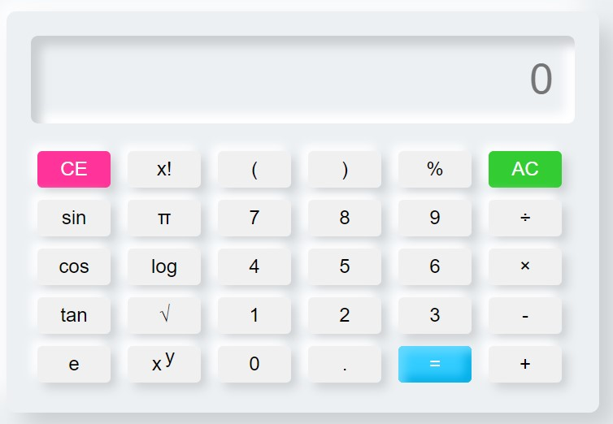
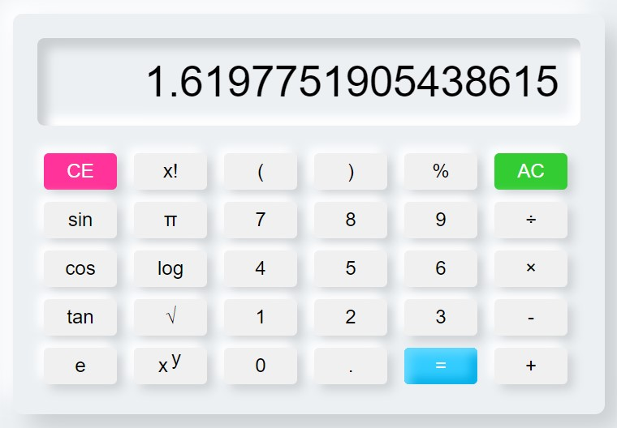

# Scientific-Calculator
Created a user-friendly scientific calculator that includes essential functions like sine, cosine, tangent, square, square root, logarithmic, exponential, factorial as well as fundamental arithmetic operations using the fundamentals of HTML, CSS and JavaScript.

About:
===== 
Scientific calculators are advanced mathematical tools that enable users to perform complex calculations, including trigonometric functions, exponential operations, and logarithmic calculations. They provide a convenient and efficient way to solve scientific and mathematical problems, making them essential for students, professionals, and researchers in various fields.

#### Steps to run the file:

Step 1:  Download the repository and unzip the files.

Step 2:  Open any IDE and save all the files. Check the path to the css file and run the `index.html` file.

#### Output Reference: 

